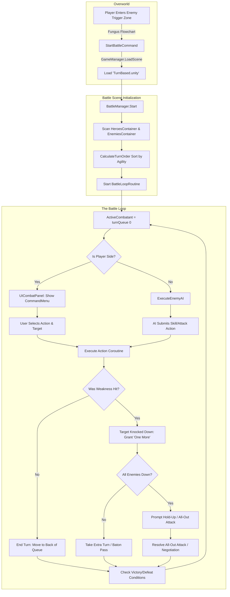

# Pixel Mindscape: Battle System Technical Specification & GDD Reference

This document provides a comprehensive technical breakdown of the turn-based battle system in **Pixel Mindscape**. It is designed to serve as both a Game Design Document (GDD) alignment reference and a detailed architectural guide for engineers and designers.

---

## 1. System Overview & Design Philosophy

The battle system in Pixel Mindscape is a dynamic, high-stakes turn-based combat system inspired by the *Persona* and *Shin Megami Tensei* series. It emphasizes tactical exploitation of enemy elemental weaknesses, action economy management, and high-impact visual choreography.

### Key Design Pillars
1. **Turn Queue Mechanics**: Turn order is strictly governed by each combatant's `EffectiveAgility`. The turn order is fully transparent to the player via a dynamic timeline UI.
2. **"One More" (Weakness Exploitation)**: Hitting an opponent's elemental weakness knocks them down and immediately grants the attacker an extra turn (`One More`).
3. **Baton Pass System**: Players who earn a `One More` can pass their extra turn to a teammate, applying cumulative offensive buffs (up to 3 stacks) for complex combo chaining.
4. **Hold-Up & All-Out Attacks**: When all enemies are knocked down (`AllEnemiesDown`), combat halts to allow the player to initiate an **All-Out Attack** (devastating party-wide Almighty damage) or enter **Shadow Negotiation**.
5. **Choreographed Asynchronous Execution**: All battle actions run as asynchronous coroutines (`IEnumerator`), allowing smooth execution of animations, particle systems, camera shakes, and damage popups without locking up the game thread.

---

## 2. High-Level Architectural Flow



---

## 3. Core Subsystems & Code Breakdown

### A. BattleManager & The State Machine
`BattleManager.cs` acts as the central coordinator for combat. It defines the state machine via `BattleState` and manages the dynamic `turnQueue`.

```csharp
public enum BattleState { Start, PlayerTurn, EnemyTurn, Resolving, PromptingAllOut, Negotiation, Victory, Defeat }
```

#### Core Battle Loop (`BattleLoopRoutine`)
The combat coroutine runs continuously until `BattleState.Victory` or `BattleState.Defeat` is reached.

```csharp
private IEnumerator BattleLoopRoutine()
{
    while (CurrentState != BattleState.Victory && CurrentState != BattleState.Defeat)
    {
        if (turnQueue.Count == 0) yield break;

        var current = turnQueue[0];

        // Remove dead combatants from queue
        if (current.IsDefeated)
        {
            turnQueue.RemoveAt(0);
            OnTurnOrderChanged?.Invoke();
            continue;
        }

        // Reset baton pass chain if it's an enemy's turn
        if (!current.IsPlayerSide) batonPassChainCount = 0;

        OnTurnStarted?.Invoke(current);
        while (isQueuePaused) yield return null;

        CurrentState = current.IsPlayerSide ? BattleState.PlayerTurn : BattleState.EnemyTurn;

        if (CurrentState == BattleState.EnemyTurn)
        {
            ExecuteEnemyAI(current);
        }

        // Wait for an action to be submitted by UI or AI
        while (pendingAction == null) yield return null;

        var action = pendingAction;
        pendingAction = null;
        CurrentState = BattleState.Resolving;

        bool isBatonPass = action is BatonPassAction;
        
        // Wait for choreographed action coroutine to complete
        yield return StartCoroutine(action.Execute(this));
        bool wasWeaknessHit = action.WasWeaknessHit;

        CheckBattleEndConditions();
        if (CurrentState == BattleState.Victory || CurrentState == BattleState.Defeat) yield break;

        if (wasWeaknessHit)
        {
            current.GrantOneMore(); 
            OnOneMoreTriggered?.Invoke(current);
        }

        // Handle All Enemies Down scenario (Hold-Up)
        if (AllEnemiesDown() && current.IsPlayerSide && !isBatonPass)
        {
            CurrentState = BattleState.PromptingAllOut;
            OnPromptAllOutAttack?.Invoke();
            
            while (CurrentState == BattleState.PromptingAllOut || CurrentState == BattleState.Negotiation)
            {
                yield return null;
            }
        }

        // Turn Queue Management
        if (isBatonPass)
        {
            current.ClearOneMore();
            turnQueue.Remove(current);
            if (!current.IsDefeated) turnQueue.Add(current);
        }
        else if (current.HasOneMore)
        {
            current.ClearOneMore();
            // Remains at the front of the queue
        }
        else
        {
            turnQueue.Remove(current);
            if (!current.IsDefeated) turnQueue.Add(current);
            if (current.IsPlayerSide) batonPassChainCount = 0;
        }

        OnTurnOrderChanged?.Invoke();
        CheckBattleEndConditions();
    }
}
```

---

### B. Combatants & DOTween Visual Integration
`Combatant.cs` is the base abstract class for all fighting entities, inherited by `HeroCombatant` and `EnemyCombatant`. It tracks vital stats (`CurrentHP`, `CurrentSP`), attributes (`BaseAttackPower`, `EffectiveAgility`), and active states (`IsDown`, `IsDefeated`).

#### Taking Damage & Knockdown Animations
Combatants utilize `DG.Tweening` (DOTween) for polished visual feedback, including screen shake upon impact and 90-degree sprite rotation upon knockdown.

```csharp
public virtual void TakeDamage(float amount, Element element)
{
    bool isHeal = amount < 0;
    if (isHeal) 
    {
        CurrentHP = Mathf.Min(CurrentHP - (int)amount, MaxHP);
    }
    else
    {
        CurrentHP = Mathf.Max(CurrentHP - (int)amount, 0);
        if (CurrentHP <= 0) IsDefeated = true;
        
        if (animator != null) animator.SetTrigger("TakeDamage");
        if (vfxHandler != null) vfxHandler.PlayHitVFX();
        
        // DOTween integration for hit animation
        transform.DOShakePosition(0.5f, 0.5f, 10, 90, false, true);
    }

    // Spawn DOTween Damage Popup
    if (BattleManager.Instance != null && BattleManager.Instance.DamagePopupPrefab != null)
    {
        var popup = Instantiate(BattleManager.Instance.DamagePopupPrefab, transform.position, Quaternion.identity);
        popup.Setup((int)amount, isHeal);
    }
}

public virtual void SetDown(bool state)
{
    IsDown = state;
    if (animator != null) animator.SetBool("IsDown", state);

    if (state)
    {
        // DOTween integration for knockdown
        transform.DORotate(new Vector3(0, 0, 90), 0.3f);
    }
    else
    {
        transform.DORotate(Vector3.zero, 0.3f);
    }
}
```

---

### C. Action Choreography (`BattleAction.cs`)
Actions encapsulate the logic, resource consumption, target application, and animation delays for a turn. All concrete actions inherit from `BattleAction`.

```csharp
public abstract class BattleAction
{
    public Combatant Source;
    public List<Combatant> Targets = new List<Combatant>(); 
    public bool WasWeaknessHit { get; protected set; }
    public abstract IEnumerator Execute(BattleManager battle);
}
```

#### Detailed Action Implementations
* **`AttackAction`**: Performs standard physical attacks, triggers `PlayAttackAnimation()`, waits `0.3f` seconds for impact, calculates damage via `DamageCalculator`, applies `SetDown(true)` if weak, and waits `0.4f` seconds for recovery.
* **`SkillAction`**: Validates and spends `spCost`. Plays `PlayCastAnimation()`, triggers custom VFX (`skill.vfxPrefab`), calculates elemental damage, checks for weakness knockdown, and pauses for dissipation.
* **`GuardAction`**: Applies defensive stance `ApplyGuardStance()` and triggers `PlayGuardAnimation()`.
* **`BatonPassAction`**: Triggers `PlayBatonPassVFX()` on both source and target, then calls `battle.PerformBatonPass(Source, PassTo)` to immediately reorder the queue.
* **`SwitchPersonaAction`**: Equips a new `PersonaRuntimeState` and calls `BattleCinematicManager.Instance.PlayPersonaSummonFlash`.
* **`ItemAction`**: Executes item effects (healing, revival, etc.) from `ItemData`.

---

### D. Damage Calculation & Affinity Multipliers
`DamageCalculator.cs` evaluates incoming elements against a defender's affinities.

```csharp
public static DamageResult CalculateDamage(Combatant attacker, Combatant defender, SkillData skill)
{
    Element element = skill != null ? skill.element : Element.Physical;
    int basePower = skill != null ? skill.basePower : attacker.BaseAttackPower;

    Affinity affinity = defender.GetAffinity(element);

    float multiplier = affinity switch
    {
        Affinity.Weak => 1.5f,
        Affinity.Resist => 0.5f,
        Affinity.Null => 0f,
        Affinity.Absorb => -1f,    
        Affinity.Repel => 0f,      
        _ => 1f
    };

    float rawDamage = basePower * attacker.GetAttackStatFor(element) * multiplier;
    float mitigated = rawDamage - defender.GetDefenseStatFor(element);

    return new DamageResult
    {
        finalDamage = Mathf.Max(mitigated, affinity == Affinity.Absorb ? rawDamage : 1f),
        affinity = affinity
    };
}
```

---

### E. Enemy AI Behavior
`BattleManager.ExecuteEnemyAI(Combatant enemy)` executes an automated two-step tactical priority routine during `BattleState.EnemyTurn`.

```csharp
private void ExecuteEnemyAI(Combatant enemy)
{
    SkillData bestSkill = null;
    Combatant bestTarget = null;

    // Priority 1: Find a skill that hits an active party member's weakness
    var availableSkills = enemy.GetAvailableSkills();
    foreach (var skill in availableSkills)
    {
        if (enemy.CurrentSP < skill.spCost) continue;

        foreach (var partyMember in activeParty)
        {
            if (partyMember.IsDefeated) continue;

            var result = DamageCalculator.CalculateDamage(enemy, partyMember, skill);
            if (result.affinity == Affinity.Weak)
            {
                bestSkill = skill;
                bestTarget = partyMember;
                break;
            }
        }
        if (bestSkill != null) break;
    }

    // Submit weakness skill if found
    if (bestSkill != null && bestTarget != null)
    {
        SubmitAction(new SkillAction { Source = enemy, Targets = new List<Combatant> { bestTarget }, skill = bestSkill });
    }
    else
    {
        // Priority 2 (Fallback): Attack the party member with the lowest HP percentage
        Combatant lowestHpTarget = null;
        foreach (var p in activeParty)
        {
            if (p.IsDefeated) continue;
            if (lowestHpTarget == null || p.HpPercent < lowestHpTarget.HpPercent)
                lowestHpTarget = p;
        }

        if (lowestHpTarget != null)
        {
            SubmitAction(new AttackAction { Source = enemy, Targets = new List<Combatant> { lowestHpTarget } });
        }
    }
}
```

---

## 4. UI Integration & GDD Alignment Gaps

The UI operates as a state machine in `UICombatPanel.cs` (`CombatUIState.Idle`, `CommandSelect`, `TargetSelect`, `SkillSelect`, `ItemSelect`).

### Target Selection Workflow
When a player clicks **Attack**, `UICombatPanel` immediately hides the main command menu and switches to `TargetSelectionView`. The player must left-click directly on an enemy sprite in the game window. A `Physics2D.Raycast` checks for a 2D collider on the `Target Layer Mask` to validate the click and submit the `AttackAction`.

### Current Codebase Implementation Gaps (Requires UI Expansion)
To fully align with the GDD, the following UI elements need to be expanded in `UICombatPanel.cs`:

1. **Victory / Defeat Handlers**: Currently, when `CurrentState == BattleState.Victory`, `BattleLoopRoutine` triggers `yield break;`. Because `UICombatPanel` is in `Idle` mode (all menus hidden), the screen remains empty. **Action Required**: Add an event or `Update()` check for `BattleState.Victory` to display a Victory Screen and return to the overworld.
2. **All-Out Attack / Hold-Up Menu**: When `AllEnemiesDown()` evaluates to true, `BattleManager` fires `OnPromptAllOutAttack` and pauses the coroutine. Currently, no UI script subscribes to this event. **Action Required**: Subscribe to `battleManager.OnPromptAllOutAttack` in `UICombatPanel.OnEnable()` and show a prompt with buttons linked to `BattleManager.Instance.ResolveAllOutAttack()`, `BattleManager.Instance.EnterNegotiation()`, and `BattleManager.Instance.CancelAllOutPrompt()`.
3. **Baton Pass Ally Targeting**: `HandleBatonPassSelected()` currently triggers a `Debug.LogWarning`. **Action Required**: Open `TargetSelectionView` with `activeParty` as valid targets to allow passing turns to teammates.
4. **Switch Persona UI**: `HandleSwitchPersonaSelected()` currently triggers a `Debug.LogWarning`. **Action Required**: Build a UI panel listing the protagonist's active Personas to submit a `SwitchPersonaAction`.
