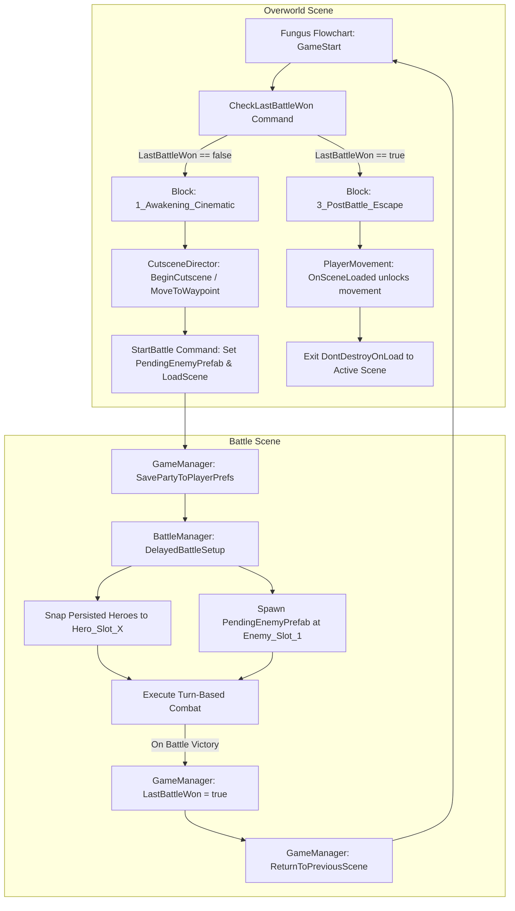

# 🎭 Fungus Flowchart & Cinematic Engine Architecture

This document provides a comprehensive architectural breakdown of how the Fungus Flowchart interacts with our custom cinematic director, scene persistence engine, and turn-based battle system to create seamless RPG cutscene transitions.

---

## 🏗️ High-Level Architectural Flow

---

## 🧩 The Core Flowchart Blocks

### 1. `GameStart` (Entry Point)
- **Trigger**: `Game Started` (fires the moment the Overworld scene loads).
- **Behavior**: Instantly executes the custom **`Check Last Battle Won`** command to decide which cinematic block should play.

### 2. `1_Awakening_Cinematic` (Initial Story & Pre-Battle)
- **Trigger**: Called by `Check Last Battle Won` when `GameManager.Instance.LastBattleWon` is `false`.
- **Execution**:
  1. Calls `CutsceneDirector.BeginCutscene()` which sets `CutsceneMode = true` on the player, preventing user input.
  2. Executes dialogue and custom waypoint animations using `MoveToWaypointCommand`.
  3. Reaches the **`Start Battle`** command, passing in the `Slime` prefab and loading the `"Battle_Standard"` scene.

### 3. `3_PostBattle_Escape` (Post-Battle Continuation)
- **Trigger**: Called by `Check Last Battle Won` when `GameManager.Instance.LastBattleWon` is `true`.
- **Execution**:
  1. Resets `LastBattleWon = false` in `GameManager`.
  2. Plays the post-victory dialogue and awards quest progression.
  3. `PlayerMovement.OnSceneLoaded` automatically removes the cutscene locks and places the player back into the active scene hierarchy so they can freely explore.

---

## 🛠️ Custom Fungus Commands

### `CheckLastBattleWonCommand`
- **Location**: [CheckLastBattleWonCommand.cs](file:///d:/Unity%20Projects/Unity-2D-Top-Down-Pixel-RPG/Assets/_Project/Scripts/Fungus/Commands/CheckLastBattleWonCommand.cs)
- **Purpose**: Acts as an intelligent branching switch. Because returning from a battle scene reloads the Overworld, this command evaluates `GameManager.Instance.LastBattleWon` to ensure the game doesn't repeat the introductory cutscene.

### `StartBattleCommand`
- **Location**: [StartBattleCommand.cs](file:///d:/Unity%20Projects/Unity-2D-Top-Down-Pixel-RPG/Assets/_Project/Scripts/Dialogue/StartBattleCommand.cs)
- **Purpose**: Initiates the scene transition to combat.
- **Key Parameters**:
  - `battleSceneName`: The exact scene string to load.
  - `enemyPrefab`: The enemy GameObject prefab (e.g., Slime) to assign to `GameManager.Instance.PendingEnemyPrefab`.

---

## 🛡️ Decoupled Scene Persistence Engine

To ensure flawless operation between the Overworld and Battle scenes without losing data or locking up components, the engine utilizes a **Triple-Layer Failsafe Architecture**:

| Stage                | Component                      | Action Taken                                                                                                                                                                                    |
| :------------------- | :----------------------------- | :---------------------------------------------------------------------------------------------------------------------------------------------------------------------------------------------- |
| **Overworld Exit**   | `GameManager.LoadScene`        | Scans the scene for all `HeroCombatant` objects, places them in `DontDestroyOnLoad`, and saves their exact HP/SP stats to `PlayerPrefs`.                                                        |
| **Battle Entry**     | `BattleManager.Start`          | Waits exactly 1 frame (`DelayedBattleSetup`), pulls the heroes from `GameManager`, deactivates scene placeholders, and snaps heroes to `Hero_Slot_X`.                                           |
| **Failsafe Backup**  | `BattleManager.Start`          | If `DontDestroyOnLoad` objects didn't carry over, takes the pre-placed heroes in the scene and injects the `PlayerPrefs` saved stats directly into them.                                        |
| **Enemy Spawn**      | `BattleManager.Start`          | Instantiates `GameManager.Instance.PendingEnemyPrefab` directly at `Enemy_Slot_1` and loads it into the turn queue.                                                                             |
| **Overworld Return** | `PlayerMovement.OnSceneLoaded` | Detects return to the Overworld, turns off `CutsceneMode`, calls `CutsceneDirector.EndCutscene()`, and uses `SceneManager.MoveGameObjectToScene` to pull the player out of `DontDestroyOnLoad`. |

---

## 🚀 Best Practices for Creating New Cutscenes

1. **Keep Blocks Modular**: Always separate pre-battle dialogue from post-battle dialogue into separate Flowchart blocks.
2. **Assign Enemy Prefabs**: When using `Start Battle`, ensure the exact enemy prefab is dragged into the command inspector in Fungus.
3. **Persist Hero Combatants**: Ensure your player and party GameObjects in the Overworld have the `HeroCombatant` script attached with `Persist Across Scenes` enabled.
